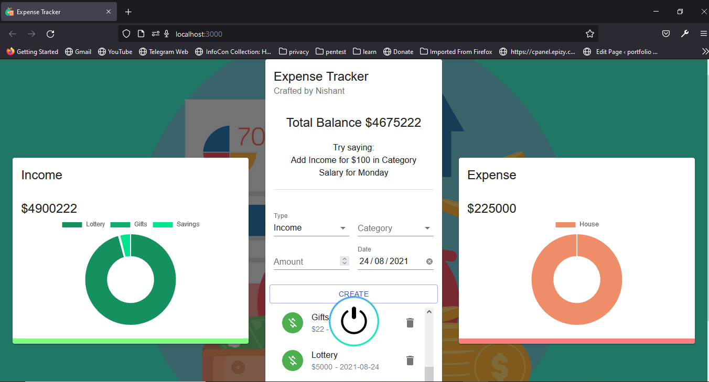
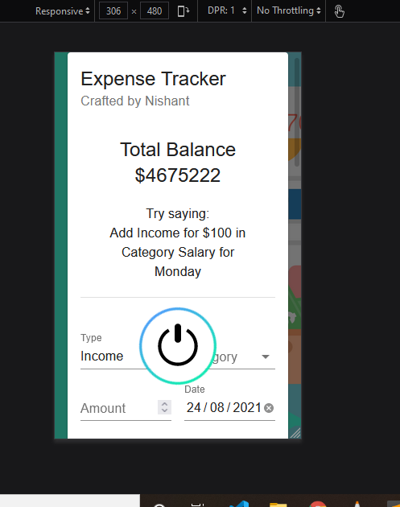

# Voice Controlled Expense Tracker



## fully responsive


## Introduction
This is a react app with voice feature to track your expenses and its have a feature of local storage so your data is saved even you cut your screen
Setup:
- run ```npm i && npm start```
